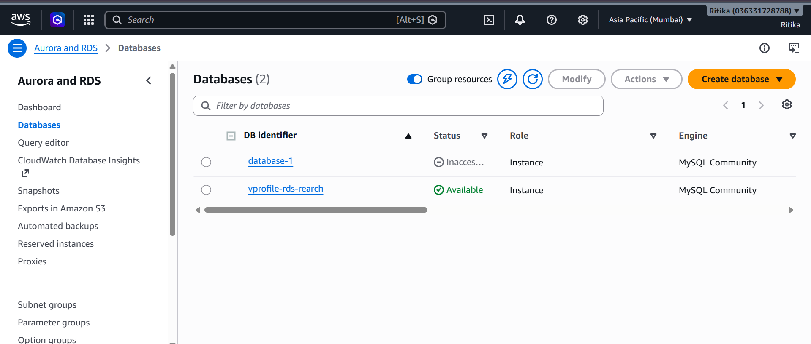
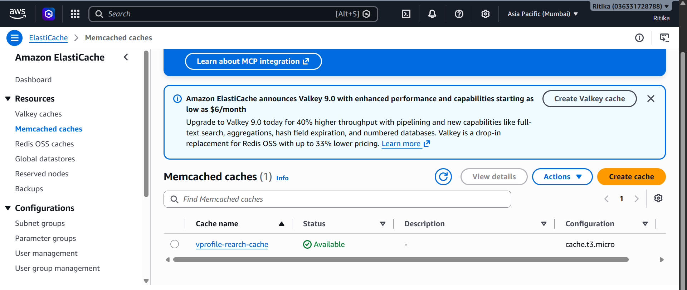
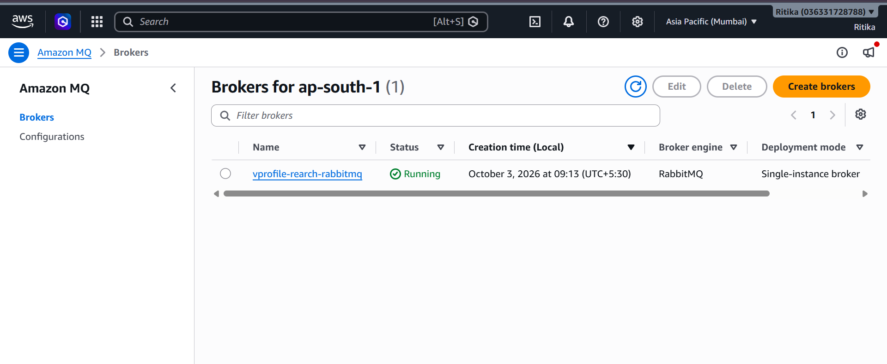
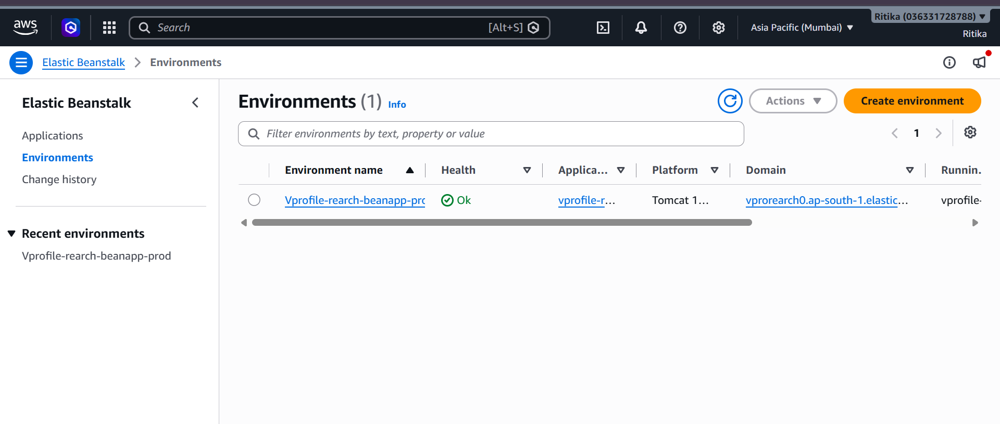
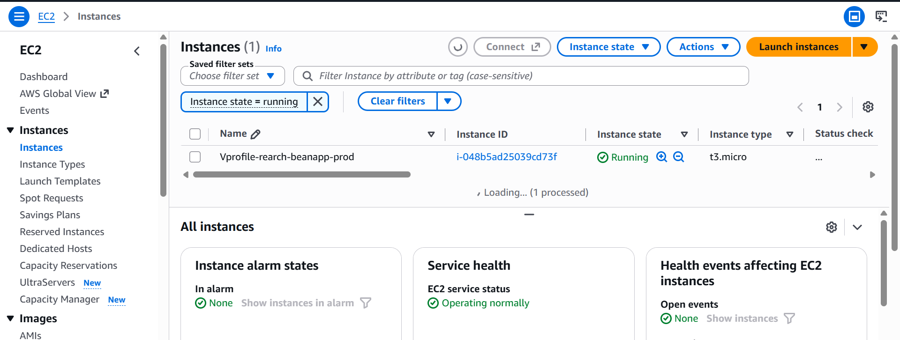
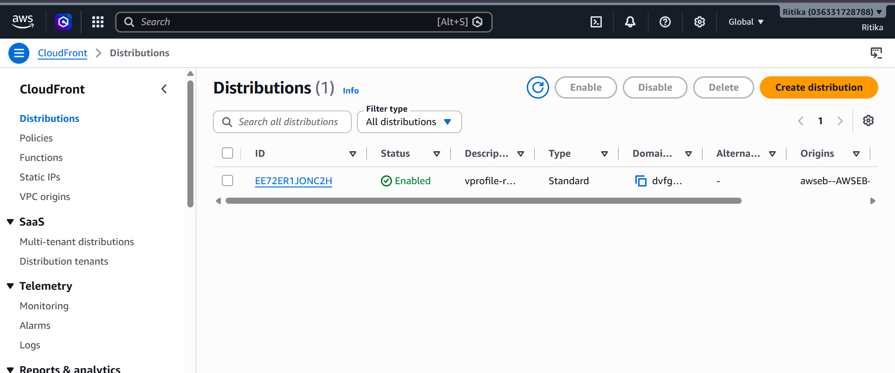
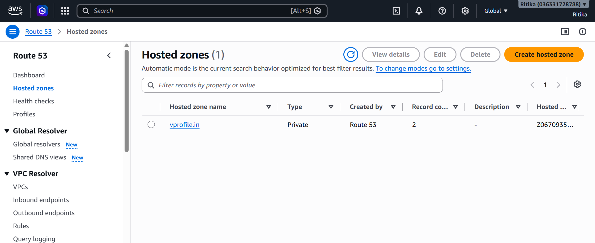
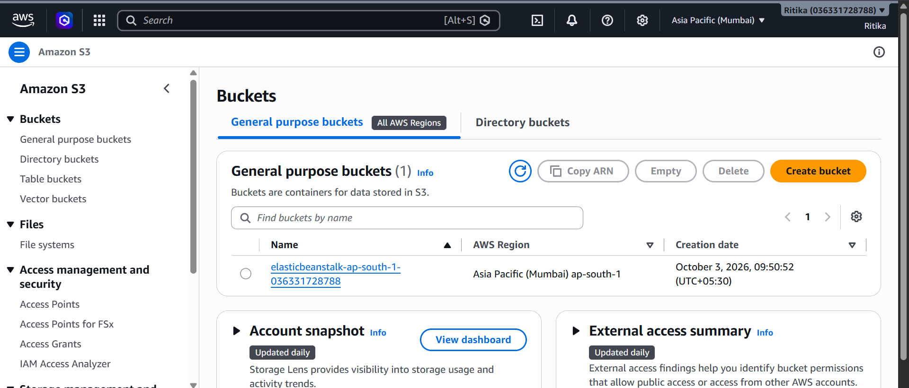

# 🚀 AWS Web Application Re-Architecture (vprofile)

## 📌 Project Overview
This project demonstrates the **re-architecture and cloud migration** of a multi-tier web application (`vprofile`) onto AWS using fully managed, scalable, and highly available AWS services. The target architecture replaces self-hosted services with managed Cloud infrastructure to ensure reliability, auto-scaling, and operational efficiency.

---

## 🛠️ AWS Services & Infrastructure Setup

### 1. Database Layer (Amazon RDS)
Provisioned a Multi-AZ **MySQL Community Edition** instance in isolated private subnets.

### 2. Caching Layer (Amazon ElastiCache)
Configured a **Memcached** cluster to cache database queries and user session states.

### 3. Messaging Layer (Amazon MQ)
Deployed a managed **RabbitMQ** broker to enable asynchronous processing between application services.

### 4. Application Layer (AWS Elastic Beanstalk)
Deployed the Java application stack on **Apache Tomcat** with Auto Scaling policies.

### 5. Content Delivery & DNS Management
- **Amazon CloudFront**: Configured CDN distribution pointing to the Beanstalk Load Balancer.
- **Amazon Route 53**: Managed internal routing using a Private Hosted Zone (`vprofile.in`).

### 6. Artifact Storage (Amazon S3)
Created secure S3 buckets for storing application build files (`.war` artifacts).

---

## 🎯 Key Benefits Realized
- **High Availability**: Multi-AZ deployments for RDS and Load Balancing across availability zones.
- **Auto-Scaling**: Automatic horizontal scaling of application nodes based on traffic volume.
- **Performance Optimization**: Reduced DB load using ElastiCache and CloudFront CDN caching.
- **Managed Operations**: Offloaded database and broker maintenance to AWS managed services.
